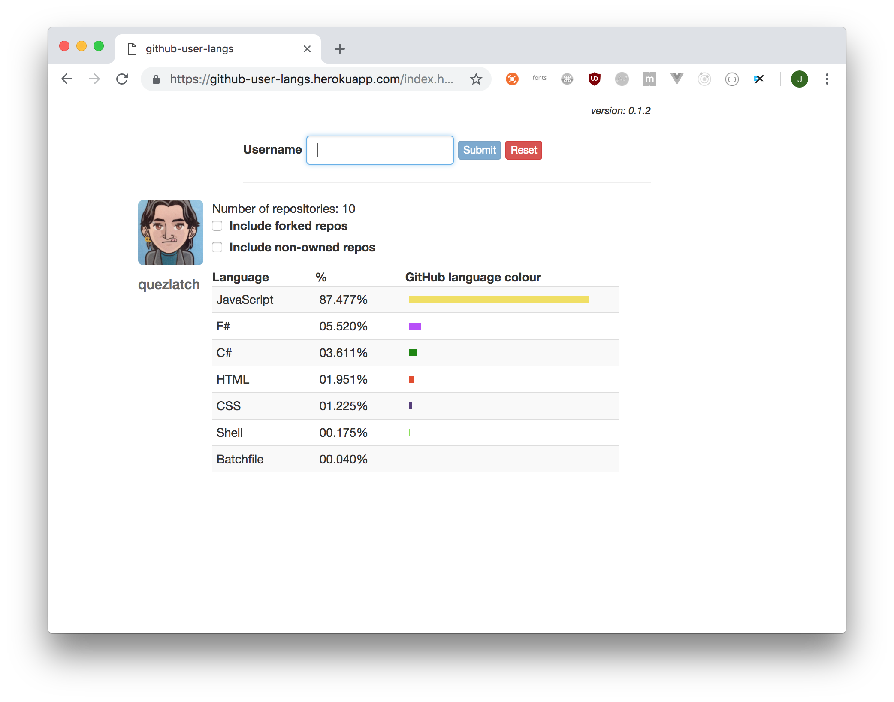

# Description

Display a breakdown of languages across a GitHub user's repositories.

# Example

## Command line interface

```
$ node cli <token> quezlatch
JavaScript..........82.791%
F#..................05.225%
Java................04.762%
C#..................03.669%
HTML................01.847%
CSS.................01.159%
Ruby................00.266%
Shell...............00.242%
Batchfile...........00.038%
```

## Web App

https://github-user-langs.herokuapp.com/index.html?username=quezlatch



# Links

* [GraphQL API v4](https://developer.github.com/v4/)
